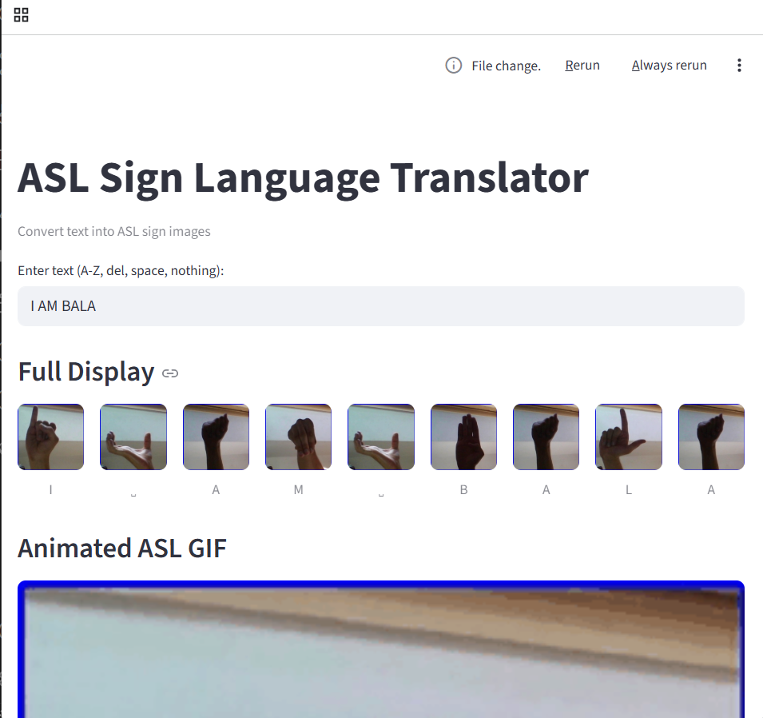

# Sign Language Recognition using CNN

This project aims to recognize American Sign Language (ASL) alphabets (A–Z) using a Convolutional Neural Network (CNN) trained on static hand gesture images. The model is trained on labeled image data and deployed through a basic Python frontend using `app.py`.

---

## Dataset Used

- The dataset contains grayscale or RGB images of hand signs corresponding to ASL letters (A–Z).
- Each image represents a single alphabet in sign language.
- During pre-processing:
  - All images were resized to 64×64 pixels.
  - Normalization was applied for efficient training.
  - Labels were one-hot encoded for classification.

A subset of the dataset was used to store the **first image of each letter** into a folder called `sign_letters/` using the script `sign.py`.

---

## Algorithm / Model Architecture

A CNN-based deep learning model was developed with the following structure:

1. **Input Layer**: 64×64×3 images
2. **Convolutional Layers**: Multiple Conv2D layers with ReLU activation
3. **MaxPooling Layers**: To reduce spatial dimensions
4. **Dropout Layers**: To prevent overfitting
5. **Flatten + Dense Layers**: Fully connected layers with softmax at the end
6. **Loss Function**: Categorical Crossentropy
7. **Optimizer**: Adam

The model was trained in the notebook: **`model_training.ipynb`**, and the final model is saved as:

```
model/asl_cnn_model.h5
```

---

## Testing

Model was tested using the notebook:

```
test.ipynb
```

This loads the trained model and performs predictions on test images or user-supplied images.

---

## Frontend UI

- The UI for prediction and user interaction is built using:
  ```
  app.py
  ```
- This file loads the model and allows users to input images and receive predictions.

---

## User Interface Preview




---

## Requirements

All dependencies for this project are listed in `requirements.txt`. You can install them using:

pip install -r requirements.txt


